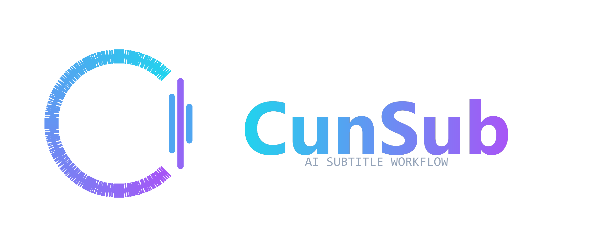

# CunSub — AI 字幕工作流助手

<p align="center">
  
</p>

CunSub 是一个面向内容创作者的 AI 字幕处理助手，基于 **Google Gemini 2.5 Pro**。它把「音频 → 理解内容 → 确认术语 → 生成字幕」这条流程串起来，关键一步是**人工确认门**：AI 理解完音频后先停下，把识别出的专业术语列给你确认和纠正，确认无误后才开始生成字幕，从源头减少术语错字。

## 为什么做 CunSub

剪映等工具的字幕对技术类口播经常翻车——「cuninbox」识别成「春inbox」这类错误很常见。CunSub 的思路是：让 AI 先理解内容、抽出专业术语，你来把关，再生成字幕。听不懂的词它不认识，你认识。

## 功能特性

- **两阶段工作流**：阶段一「音频理解 + 术语抽取」，阶段二「字幕生成」，中间有人工确认门
- **专业术语库**：已确认的术语沉淀到本地术语库，下次遇到同类内容识别更准
- **术语纠正**：AI 识别错的词可以直接点改（如「春inbox」→「cuninbox」），纠正结果会传给 Gemini 并写入术语库
- **实时进度计时**：上传、音频提取、AI 理解、字幕生成每一步都有逐秒跳动的实时计时
- **字幕质量**：以剪映可直接导入的 SRT 为基准，细粒度断句、每字幕 1.5–3 秒、无冗余空格
- **三种导出格式**：SRT / VTT / ASS 一键导出，文件名带品牌标识
- **本地运行**：数据存在本地 SQLite，不经过任何第三方服务器（Gemini API 除外）

## 工作流程

```
上传音视频 → 提取音频 → Gemini 理解(术语抽取) → 人工确认/纠正术语 → 生成字幕 → 逐条校对 → 导出 SRT/VTT/ASS
```

## 技术栈

| 层 | 技术 |
| --- | --- |
| 后端 | Python + FastAPI + Uvicorn |
| AI | Google Gemini 2.5 Pro（`google-genai` SDK，流式输出） |
| 前端 | React + Vite + TailwindCSS |
| 存储 | SQLite |
| 音频处理 | ffmpeg + pydub |

## 快速开始

### 环境要求

- Windows（也可在 macOS/Linux 上手动启动前后端）
- Python 3.10+
- Node.js 18+
- ffmpeg（已加入 PATH）
- Gemini API Key：需能访问 Google API（国内环境需配置代理）

### 安装与配置

```bash
# 1. 安装后端依赖
cd backend
pip install -r requirements.txt

# 2. 配置 API Key
#    复制 backend/.env.example 为 backend/.env，填入你的 Key
GEMINI_API_KEY=你的key

# 3. 安装前端依赖
cd ../frontend
npm install
```

### 启动

Windows 一键启动（双击即可，自动打开浏览器）：

```bat
start.bat
```

手动启动：

```bash
# 终端 1：后端 (端口 5278)
cd backend && python run.py

# 终端 2：前端 (端口 5277)
cd frontend && npm run dev
```

浏览器访问 http://localhost:5277

> **代理说明**：`backend/.env` 中的 `GEMINI_PROXY` 留空时，程序会自动检测 Windows 系统代理；也可手动指定：
> `GEMINI_PROXY=http://127.0.0.1:7890` 或 `GEMINI_PROXY=socks5://127.0.0.1:10808`

## 目录结构

```
CunSub/
├── backend/                  # FastAPI 后端
│   ├── app/
│   │   ├── main.py           # 应用入口、/branding 品牌下发接口
│   │   ├── config.py         # 配置、代理检测、品牌信息
│   │   ├── database.py       # SQLite 初始化
│   │   ├── models.py         # 数据模型
│   │   ├── prompts.py        # Gemini 提示词（理解 / 生成）
│   │   ├── routers/          # projects / workflow / export 路由
│   │   └── services/         # 音频、Gemini、字幕、进度服务
│   ├── run.py                # 后端启动脚本
│   └── requirements.txt
├── frontend/                 # React + Vite 前端
│   ├── src/
│   │   ├── pages/            # 项目列表 / 上传 / 术语确认 / 字幕校对
│   │   ├── api/client.js     # 后端 API 封装
│   │   └── App.jsx
│   └── index.html
├── logo/                     # Logo 源文件与生成脚本
├── start.bat / start.ps1     # Windows 一键启动
└── test.srt                  # 剪映标准字幕样例（生成基准）
```

## 开源协议

本项目基于 [MIT License](LICENSE) 开源。

**使用须知**：MIT 允许自由使用、修改、商用，但使用本项目（含二次开发、分发、部署）时请保留原作者版权声明。

---

## 关于作者

- **村长实验室** — <https://czlab.dev>
- **村长博客** — <https://www.cunzhangblog.com>

由村长实验室设计开发 · © 2026 CunSub
